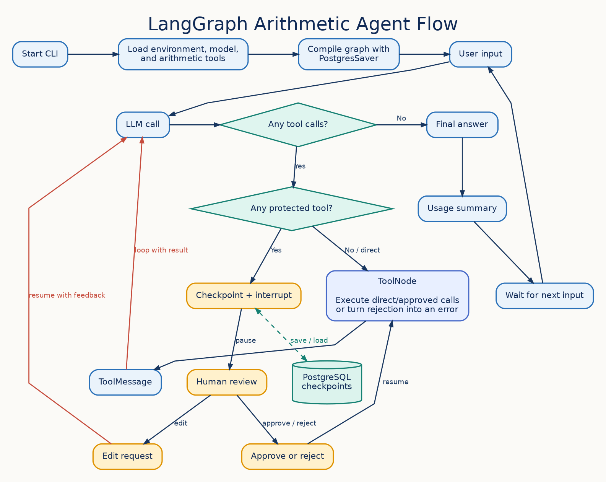

# Learning LangGraph

This repository contains small LangGraph examples. The current `main.py` example
is an interactive arithmetic agent that combines tool calling, selective human
approval, PostgreSQL checkpoints, streaming output, and token-usage reporting.

## `main.py` process



The graph follows three routes after each model response:

1. If there are no tool calls, the response is final and usage is printed.
2. If no requested tool appears in `TOOLS_REQUIRING_APPROVAL`, `ToolNode`
   executes the calls directly.
3. If any requested tool requires approval, LangGraph checkpoints and interrupts
   the run. Approved calls execute, rejected calls become error `ToolMessage`s,
   and edit requests return feedback to the model so it can propose corrected
   calls.

Every `ToolMessage` returns to the model. The model can then request another tool
or produce the final answer. `PostgresSaver` preserves interrupted runs using the
configured thread ID, so the CLI can resume the exact pending review.

The editable Graphviz source for the diagram is
[`docs/main-process.dot`](docs/main-process.dot). Regenerate the PNG with:

```bash
dot -Tpng docs/main-process.dot -o docs/main-process.png
```

## Run the interactive agent

Install the project dependencies:

```bash
uv sync
```

Copy the environment template and replace its placeholder values:

```bash
cp .env.example .env
```

`DATABASE_URL` must point to an existing PostgreSQL database. The checkpointer
creates its own tables when `main.py` starts.

Run the CLI:

```bash
uv run python main.py
```

Enter an arithmetic request, then approve, edit, or reject any protected tool
calls. Enter `exit` or `quit` to stop the program.

By default, all four arithmetic tools require approval:

```python
TOOLS_REQUIRING_APPROVAL = {tool.name for tool in tools}
```

Replace that expression with a subset such as `{"divide"}` when other tools
should execute directly.
